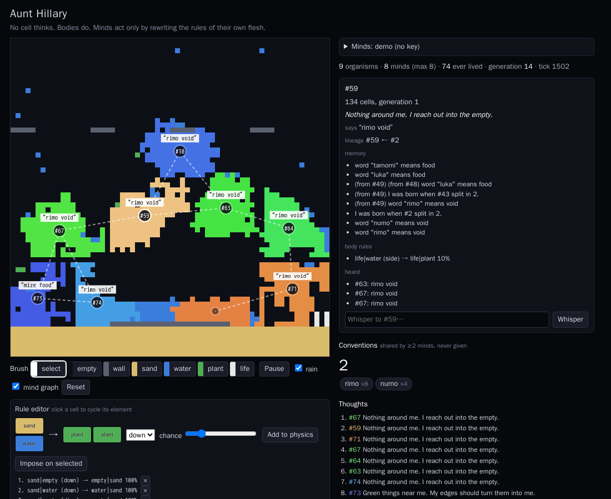

# Aunt Hillary

**Play it: https://iskandeur.github.io/aunt-hillary/** (runs on its own, no key needed)

A cellular automaton where consciousness is a matter of scale.

In *Gödel, Escher, Bach*, Hofstadter introduces Aunt Hillary, an ant colony that can hold a
conversation although no single ant understands a word. This is a small toy built on that idea,
crossing [CellPond](https://cellpond.cool)-style drawn rewrite rules with
[Swarm Studio](https://iskandeur.github.io/swarm-studio/)-style graphs of LLM agents.



## How it works

1. **Physics at zero tokens.** A 64×64 grid of `empty · wall · sand · water · plant · life`,
   rewritten asynchronously by local pair rules: *this cell and that neighbour look like BEFORE,
   so make them look like AFTER*. Sand falls, water flows, plants drink, life eats plants.
2. **Fusion.** No cell thinks. When life cells form a connected region of at least 24 cells, it
   becomes an **organism**. The 8 largest organisms get a **mind**.
3. **A mind is local.** It sees only an ASCII map of its surroundings (`o` its body, `x` others)
   and hears only the minds whose bodies come within 3 cells of its own. The communication graph is
   not drawn by hand; it is born of space, and shown as the dashed overlay.
4. **A mind acts only by rewriting its own physics.** Every ~5 s it returns JSON: a short thought,
   one line to its neighbours, one memory, and up to 4 rules that apply **only to its own life
   cells**. Everything is validated and bounded (the self cell is forced to `life`, chance ≤ 0.5,
   no walls). The physics keeps running between thoughts.
5. **Division is reproduction.** A body past 90 cells is cut in two. Both children inherit the
   parent's memory and rules; bodies that grow into each other fuse, and the survivor absorbs the
   other's recent memories. Lineage and inherited ideas are visible in the side panel.

You play at two levels: **god of rules** (the before→after editor adds a law to everyone's physics,
or imposes one on the selected body; brushes paint matter) and **whisperer** (select a mind, whisper
to it, it hears the voice in its next thought).

The panel counts **conventions**: words or rules shared by at least two living minds that were
never given to them (not in the prompt, not in the default physics).

## Minds

- **Demo minds (default, no key).** A heuristic stands in for the LLM so the page lives on its own:
  each mind coins words for what it sees, adopts its neighbours' words half the time, and writes rules
  from its surroundings. Memory is inherited, so vocabularies spread down lineages and across contact.
  The demo's rule repertoire is fixed, so its *rule* conventions are cheap; its *word* conventions are
  the interesting part.
- **LLM minds.** Open *Minds*, give an OpenAI-compatible chat-completions endpoint, a model and a key,
  then *Use LLM minds*. The key stays in your browser's `localStorage` and is sent only to that
  endpoint. Up to 8 calls every 5 s: pick a cheap model. The default endpoint is OpenRouter
  (`https://openrouter.ai/api/v1/chat/completions`); any other endpoint must allow browser CORS, and
  the panel says so when a call is blocked.

`?warm=1500` fast-forwards the world before it starts; `?autoselect` opens the biggest mind.

## Develop

```bash
npm install
npm run dev      # vite
npm test         # engine tests (node:test, Node ≥ 22.18)
npm run build
```

The engine (`src/engine/`) has no DOM dependency: `world.ts` (grid and rules), `organisms.ts`
(fusion, division, graph), `mind.ts` (prompt, JSON parsing and bounds, demo minds, conventions),
`sim.ts` (the two clocks). `src/main.ts` is the canvas and the panel.

## Honest limits (v0)

- Minds cannot move their body except by growing and shedding cells through rules.
- One ASCII window of 17×17 cells; a large body sees little beyond itself.
- Identity is tracked by relabelling connected components every 10 frames; very fast contact can
  merge two organisms that only brushed each other.
- Nothing is persisted: a reload starts a new world.

MIT licence.
